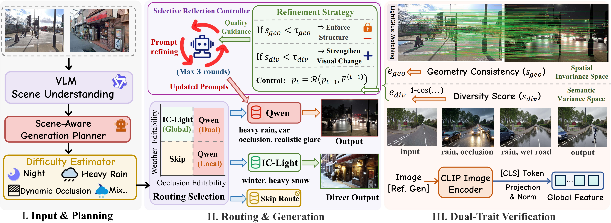
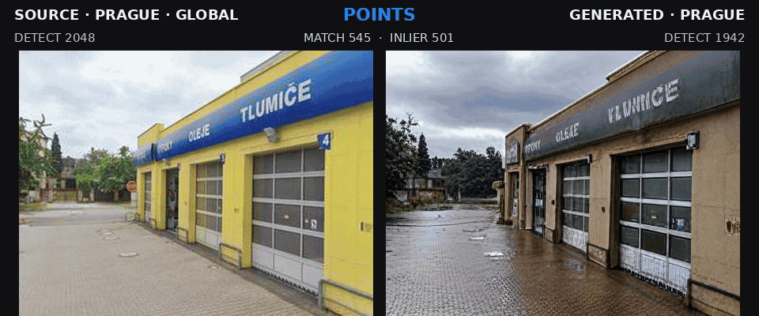
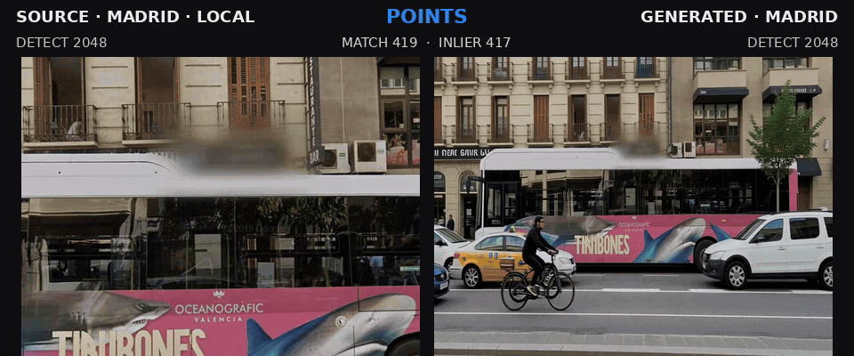
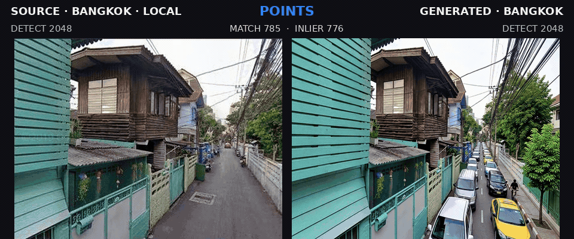
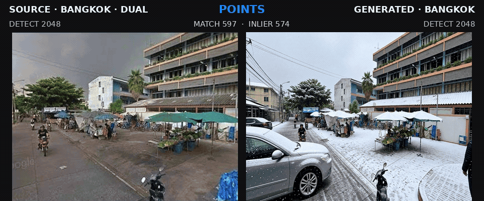
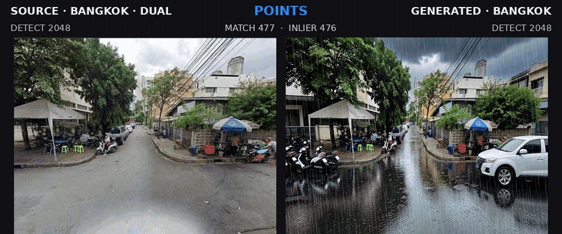
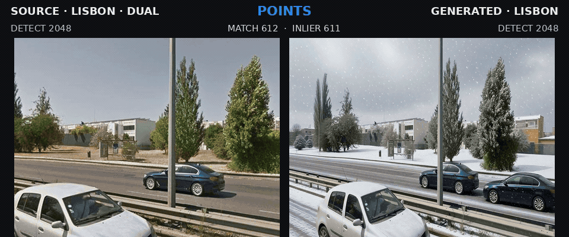

# AdaptVPR

Official repository for [AdaptVPR: Route-Aware Hard Positive Generation for Robust Visual Place Recognition](https://arxiv.org/abs/2609.04369).

<p align="center">
  <a href="https://arxiv.org/abs/2609.04369"></a>
  <a href="https://huggingface.co/datasets/shunpeng/AdaptCities"></a>
</p>

## 📢 News

- **2026-09-10** — ⚡ Improved planning reproducibility and verification efficiency with fully documented scheduler configuration and content-validated CLIP reference-feature caching.
- **2026-09** — 📄 Paper released on arXiv: [AdaptVPR: Route-Aware Hard Positive Generation for Robust Visual Place Recognition](https://arxiv.org/abs/2609.04369).
- **2026-09** — 🚀 Released the AdaptVPR generation code, verification pipeline, prompt templates, and reproducibility documentation.
- **2026-09** — 📦 Released the AdaptCities prompts, annotations, and metadata on [Hugging Face](https://huggingface.co/datasets/shunpeng/AdaptCities).

## 📝 Method overview


> **Method overview.** AdaptVPR combines scene understanding, generation tailored to each route, selective prompt reflection, and verification of geometric consistency and appearance diversity to improve VPR robustness under changes in weather, illumination, and occlusion.

| Route | Edit | Generator | Policy |
|---|---|---|---|
| Global | Weather / illumination / time | [IC-Light](https://github.com/lllyasviel/IC-Light) | 1 attempt; reject on failure |
| Local | Local occlusion | [Qwen-LightX2V](https://github.com/ModelTC/LightX2V) | ≤4 attempts; ≤3 refinements |
| Dual | Global + local changes | [Qwen-LightX2V](https://github.com/ModelTC/LightX2V) | ≤4 attempts; ≤3 refinements |
| Skip | Unsuitable input | None | No generation |

Candidates are accepted only when both $s_{\mathrm{geo}} \ge \tau_{\mathrm{geo}}$ and $s_{\mathrm{div}} \ge \tau_{\mathrm{div}}$.

Scene planning is implemented in `generation/agent.py`, while prompt refinement is handled by `generation/reflection_controller.py`; both are used by the public entry point.

| Threshold | Global | Local | Dual | Dual (rain + vehicle) |
|:---:|:---:|:---:|:---:|:---:|
| $\tau_{\mathrm{geo}}$ | 0.78 | 0.82 | 0.72 | 0.72 |
| $\tau_{\mathrm{div}}$ | 0.15 | 0.09 | 0.20 | 0.12 |

## 📁 Expected workspace layout

```text
workspace/
├── Gsvcities/
│   ├── Images/
│   └── Dataframes/
└── AdaptVPR/
    ├── adapters/                      # Generator HTTP services and dependencies
    ├── assets/
    │   └── Method.png                 # Paper method overview
    ├── configs/
    │   └── default.env.example        # Public configuration template
    ├── docs/
    │   ├── EXTERNAL_COMPONENTS.md     # Third-party setup and integration map
    │   ├── API_CONTRACTS.md           # Generator HTTP service contracts
    │   └── SCHEDULER.md               # Route quotas, parameters, and run semantics
    ├── examples/
    │   ├── generated_prompts.example.jsonl
    │   └── annotations_metadata.example.jsonl
    ├── generation/                    # Planning, generation, routing and reflection
    ├── preprocessing/                 # Accepted-sample manifest processing
    ├── prompts/                       # Prompt templates and construction rules
    ├── requirements.txt               # Main AdaptVPR dependencies
    ├── run.py                         # Planner and frozen-prompt batch entry point
    ├── scripts/
    │   ├── build_manifest.py          # Export accepted training candidates
    │   └── start_generation_services.sh
    ├── tests/                         # Unit tests and 10-source demo files
    └── verification/                  # Geometry and appearance verification
```

## 🛠️ Installation

Python 3.10 or newer is recommended.

```bash
git clone https://github.com/chenshunpeng/AdaptVPR.git
cd AdaptVPR
python -m venv .venv
source .venv/bin/activate
pip install -r requirements.txt
cp configs/default.env.example .env
```

To run the included HTTP adapters, install their service dependencies separately:

```bash
pip install -r adapters/requirements.txt
```

Install and configure IC-Light, Qwen-LightX2V, VisMatch, and a Qwen3-VL-4B-Instruct endpoint separately. Their implementations and weights are not included. Set local paths, endpoints, and credentials in `.env`.

## 🧩 External components

| Role | Component | Integration | Public default |
|---|---|---|---|
| Planner and prompt refiner | [Qwen3-VL-4B-Instruct](https://huggingface.co/Qwen/Qwen3-VL-4B-Instruct) | OpenAI-compatible API | `127.0.0.1:23002/v1` |
| Global generator | [IC-Light](https://github.com/lllyasviel/IC-Light) | Local HTTP adapter | `127.0.0.1:8002/generate` |
| Local/Dual generator | [Qwen-LightX2V](https://github.com/ModelTC/LightX2V) | Local HTTP adapter | `127.0.0.1:8001/generate` |
| Appearance verifier | [CLIP ViT-B/32](https://huggingface.co/openai/clip-vit-base-patch32) | Transformers local loading | `openai/clip-vit-base-patch32` |
| Geometry verifier | [VisMatch (SuperPoint + LightGlue)](https://github.com/gmberton/vismatch) | Local Python import | `superpoint-lightglue` |

See [Scheduler specification](docs/SCHEDULER.md) for the route-allocation parameters and exact quota rule, [External components](docs/EXTERNAL_COMPONENTS.md) for setup responsibilities, and [API contracts](docs/API_CONTRACTS.md) for the IC-Light and LightX2V interfaces.

## ⚡ Quick Demo

Before running a full generation job, use the ten GSV-Cities paths listed in `tests/demo_10.csv` to quickly check the planning, generation, reflection, and verification pipeline. Source images are not included; run:

Source-to-generated image comparisons for this 10-image Quick Demo set are
available in [`tests/output`](tests/output).

```bash
python tests/run_demo_10.py \
  --gsvcities-root /path/to/Gsvcities \
  --output ./outputs/demo_10
```

This command uses Qwen3-VL-4B planning and enables up to three prompt-reflection attempts by default.

## 🚀 Generation

Local and Dual routes use one initial generation and up to three reflection rounds; Global uses one generation.

Accepted final images (`passed=true` and `eligible_for_training=true`) are saved under `<output-root>/<route>/`, while failed candidates are retained for audit under `<output-root>/rejected/<route>/` with a `__rejected.jpg` suffix. Training should use the manifest generated by `scripts/build_manifest.py`, which includes only accepted candidates; generated images are not distributed by this repository.

```bash
# Plan routes and prompts with Qwen3-VL-4B-Instruct.
python run.py /path/to/Gsvcities/Images --mode plan --output ./outputs/planner \
  --reflection on --max-reflections 3

# Generate directly from released initial prompts.
python run.py /path/to/AdaptCities/prompts/by_city/Bangkok.jsonl --mode prompt \
  --image-root ./Gsvcities/Images \
  --output ./outputs/prompt \
  --reflection on --max-reflections 3
```

## 📦 Data Availability and License

We release the AdaptVPR generation code, processing pipeline, and prompt templates. Original GSV-Cities and generated AdaptCities images are not redistributed; obtain [GSV-Cities](https://github.com/amaralibey/gsv-cities) separately for reproduction.

The released AdaptCities prompts, annotations, and metadata are available on [Hugging Face](https://huggingface.co/datasets/shunpeng/AdaptCities).

## 🙏 Acknowledgements

This project builds on [Qwen3-VL-4B-Instruct](https://huggingface.co/Qwen/Qwen3-VL-4B-Instruct), [IC-Light](https://github.com/lllyasviel/IC-Light), [Qwen-LightX2V](https://github.com/ModelTC/LightX2V), [VisMatch](https://github.com/gmberton/vismatch), [CLIP](https://huggingface.co/openai/clip-vit-base-patch32), and [GSV-Cities](https://github.com/amaralibey/gsv-cities).

We also thank the authors of [BoQ](https://github.com/amaralibey/Bag-of-Queries), [ImAge](https://github.com/buptzjy/ImAge), [SALAD](https://github.com/serizba/salad), and [EDTFormer](https://github.com/buptzjy/EDTFormer) for their public implementations.

## 📌 Citation

If you find this repository useful for your research, please consider giving it a ⭐ and citing our [paper](https://arxiv.org/abs/2609.04369):

```bibtex
@article{chen2026adaptvpr,
  title   = {AdaptVPR: Route-Aware Hard Positive Generation for Robust Visual Place Recognition},
  author  = {Chen, Shunpeng and Zhang, Jingyi and Wang, Changwei and Xu, Shengpeng and Song, Yukun and Pei, Xingtian and Lin, Jinzhou and Guo, Li and Xu, Shibiao},
  journal = {arXiv preprint arXiv:2609.04369},
  year    = {2026}
}
```

## AdaptVPR Matching Demo

<p align="center">
  
  
</p>

<p align="center">
  
  
</p>

<p align="center">
  
  
</p>
